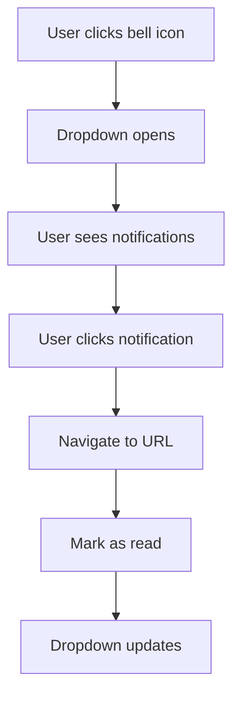
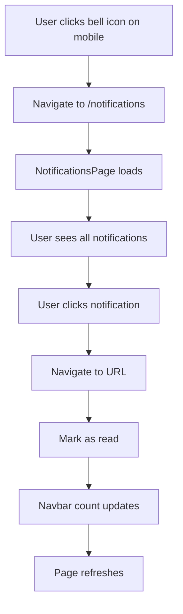
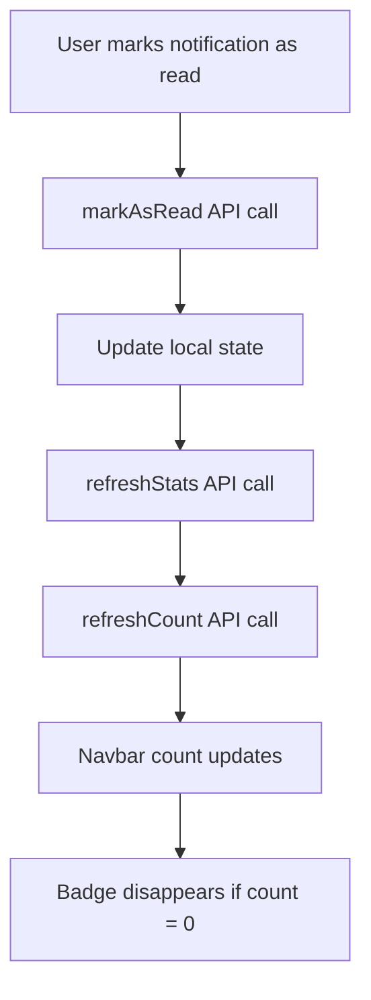
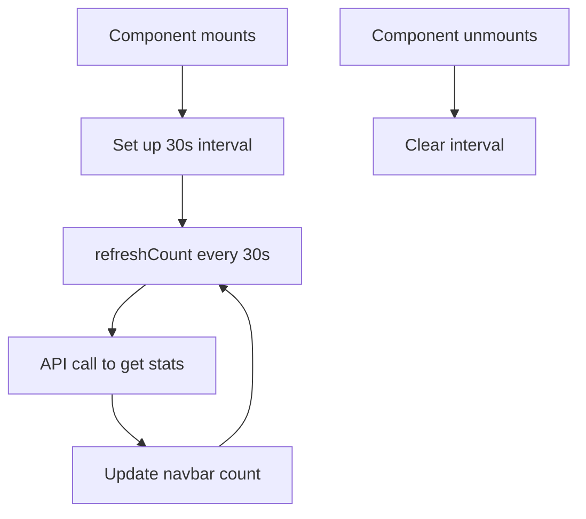

# Mobile Notification Navigation & Auto-Refresh

## 📱 Overview

Đã cập nhật **NotificationBell** để trên mobile khi nhấn vào icon thông báo sẽ **navigate trực tiếp đến page notifications**, và **tự động refresh navbar count** khi đánh dấu đã đọc.

## 🎯 Key Features

### **1. Mobile-First Navigation**
- ✅ **Mobile Detection**: Tự động detect mobile screen (< 768px)
- ✅ **Direct Navigation**: Nhấn vào icon bell trên mobile → navigate đến `/notifications`
- ✅ **Desktop Dropdown**: Trên desktop vẫn hiển thị dropdown menu như cũ

### **2. Auto-Refresh Navbar Count**
- ✅ **Real-time Updates**: Navbar count tự động cập nhật khi mark as read
- ✅ **Cross-Component Sync**: Sync giữa NotificationBell và NotificationsPage
- ✅ **Periodic Refresh**: Tự động refresh count mỗi 30 giây

## 🔄 Implementation Details

### **1. Mobile Detection Logic**

```tsx
// Detect mobile screen size
useEffect(() => {
  const checkMobile = () => {
    setIsMobile(window.innerWidth < 768);
  };
  
  checkMobile();
  window.addEventListener('resize', checkMobile);
  
  return () => window.removeEventListener('resize', checkMobile);
}, []);
```

**Features:**
- ✅ **Responsive**: Tự động detect khi resize window
- ✅ **Breakpoint**: 768px là breakpoint giữa mobile và desktop
- ✅ **Cleanup**: Proper cleanup event listener

### **2. Mobile Navigation**

```tsx
// Handle mobile click - navigate directly to notifications page
const handleMobileClick = () => {
  navigate('/notifications');
};

// On mobile, show simple button that navigates to notifications page
if (isMobile) {
  return (
    <Button 
      variant="ghost" 
      size="sm" 
      className="relative h-9 w-9 p-0"
      onClick={handleMobileClick}
    >
      <Bell className="w-5 h-5" />
      {unreadCount > 0 && (
        <Badge 
          variant="destructive" 
          className="absolute -top-1 -right-1 h-5 w-5 flex items-center justify-center p-0 text-xs font-bold"
        >
          {unreadCount > 99 ? '99+' : unreadCount}
        </Badge>
      )}
    </Button>
  );
}
```

**Features:**
- ✅ **Simple Button**: Chỉ là button đơn giản, không có dropdown
- ✅ **Direct Navigation**: Sử dụng `useNavigate()` để navigate
- ✅ **Badge Display**: Vẫn hiển thị unread count badge
- ✅ **Consistent Styling**: Giữ nguyên styling với desktop

### **3. Auto-Refresh Navbar Count**

#### **New Hook: useNotificationCount**

```tsx
export function useNotificationCount(): UseNotificationCountReturn {
  const [unreadCount, setUnreadCount] = useState(0);
  const [totalCount, setTotalCount] = useState(0);
  const [loading, setLoading] = useState(false);
  const [error, setError] = useState<string | null>(null);

  const refreshCount = useCallback(async () => {
    try {
      setLoading(true);
      setError(null);
      
      const stats = await notificationService.getNotificationStats();
      setUnreadCount(stats.unread);
      setTotalCount(stats.total);
    } catch (err) {
      console.error('Error fetching notification count:', err);
      setError(err instanceof Error ? err.message : 'Failed to fetch notification count');
    } finally {
      setLoading(false);
    }
  }, []);

  // Initial load
  useEffect(() => {
    refreshCount();
  }, [refreshCount]);

  // Set up interval to refresh count periodically
  useEffect(() => {
    const interval = setInterval(refreshCount, 30000); // Refresh every 30 seconds
    
    return () => clearInterval(interval);
  }, [refreshCount]);

  return {
    unreadCount,
    totalCount,
    loading,
    error,
    refreshCount,
  };
}
```

**Features:**
- ✅ **Dedicated Hook**: Hook riêng để quản lý notification count
- ✅ **Auto Refresh**: Tự động refresh mỗi 30 giây
- ✅ **Error Handling**: Proper error handling
- ✅ **Loading States**: Loading states cho better UX

#### **Updated NotificationBell**

```tsx
export function NotificationBell() {
  // Use notification count hook for navbar
  const { unreadCount, refreshCount } = useNotificationCount();
  
  // Use notifications hook for dropdown content
  const { 
    notifications, 
    loading, 
    markAsRead, 
    refreshStats 
  } = useNotifications();

  const handleMarkAsRead = async (notificationId: string) => {
    await markAsRead([notificationId]);
    await refreshStats();
    // Refresh navbar count
    await refreshCount();
  };

  const handleMarkAllAsRead = async () => {
    const unreadIds = notifications
      .filter(n => n.status === NotificationStatus.UNREAD)
      .map(n => n.id);
    
    if (unreadIds.length > 0) {
      await markAsRead(unreadIds);
      await refreshStats();
      // Refresh navbar count
      await refreshCount();
    }
  };
}
```

**Features:**
- ✅ **Dual Hooks**: Sử dụng cả `useNotificationCount` và `useNotifications`
- ✅ **Auto Sync**: Tự động sync count khi mark as read
- ✅ **Consistent State**: Đảm bảo state consistency

#### **Updated NotificationsPage**

```tsx
function NotificationsPage() {
  const {
    // ... existing hooks
  } = useNotifications();

  // Use notification count hook to refresh navbar
  const { refreshCount } = useNotificationCount();

  const handleMarkAsRead = async (id: string) => {
    await markAsRead([id]);
    // Refresh navbar count
    await refreshCount();
  };

  const handleMarkAllAsRead = async () => {
    await markAllAsRead();
    // Refresh navbar count
    await refreshCount();
  };

  const handleDelete = async (id: string) => {
    await deleteNotification(id);
    // Refresh navbar count
    await refreshCount();
  };

  const handleClearRead = async () => {
    await clearReadNotifications();
    // Refresh navbar count
    await refreshCount();
  };

  const handleRefresh = async () => {
    await fetchNotifications();
    await refreshStats();
    // Refresh navbar count
    await refreshCount();
  };
}
```

**Features:**
- ✅ **Consistent Refresh**: Tất cả actions đều refresh navbar count
- ✅ **Real-time Updates**: Navbar count cập nhật ngay lập tức
- ✅ **Cross-Component Sync**: Sync giữa page và navbar

## 📱 Mobile UX Flow

### **Before (Desktop-focused):**


### **After (Mobile-optimized):**


## 🔄 Auto-Refresh Flow

### **Navbar Count Refresh:**


### **Periodic Refresh:**


## 🎯 Benefits

### **For Mobile Users:**
- ✅ **Simplified Navigation**: Không cần mở dropdown, navigate trực tiếp
- ✅ **Better UX**: Phù hợp với mobile interaction patterns
- ✅ **Real-time Updates**: Navbar count luôn chính xác
- ✅ **Consistent State**: Không bị lag giữa các components

### **For Desktop Users:**
- ✅ **Unchanged Experience**: Desktop vẫn hoạt động như cũ
- ✅ **Better Performance**: Auto-refresh giúp data luôn fresh
- ✅ **Real-time Sync**: Navbar và page luôn sync

### **For Developers:**
- ✅ **Clean Architecture**: Separation of concerns với dedicated hooks
- ✅ **Maintainable Code**: Logic được tách biệt rõ ràng
- ✅ **Reusable Hooks**: `useNotificationCount` có thể reuse
- ✅ **Consistent API**: Tất cả components sử dụng cùng pattern

## 📱 Testing Scenarios

### **Mobile Testing:**
1. **Screen Size < 768px**: Bell icon should navigate to `/notifications`
2. **Screen Size >= 768px**: Bell icon should show dropdown
3. **Resize Window**: Should switch between mobile/desktop behavior
4. **Mark as Read**: Navbar count should update immediately
5. **Periodic Refresh**: Count should update every 30 seconds

### **Desktop Testing:**
1. **Dropdown Functionality**: Should work as before
2. **Mark as Read**: Navbar count should update
3. **Cross-Component Sync**: Page and navbar should stay in sync

### **Edge Cases:**
1. **Network Errors**: Should handle API errors gracefully
2. **Rapid Actions**: Should handle multiple rapid mark-as-read actions
3. **Component Unmount**: Should cleanup intervals properly

## 🚀 Performance Considerations

### **Optimizations:**
- ✅ **Debounced API Calls**: Avoid rapid API calls
- ✅ **Cached Data**: Use existing data when possible
- ✅ **Cleanup**: Proper cleanup of intervals and listeners
- ✅ **Error Handling**: Graceful error handling

### **Memory Management:**
- ✅ **Event Listeners**: Proper cleanup of resize listeners
- ✅ **Intervals**: Clear intervals on unmount
- ✅ **State Updates**: Avoid unnecessary re-renders

## 📁 Files Updated

- ✅ **NotificationBell.tsx**: Mobile navigation + auto-refresh
- ✅ **NotificationsPage.tsx**: Auto-refresh navbar count
- ✅ **useNotificationCount.ts**: New hook for navbar count
- ✅ **MOBILE-NAVIGATION-REFRESH.md**: Documentation

## 🎉 Summary

**Mobile Notification Navigation** đã được cập nhật với:

- ✅ **Mobile-First Navigation**: Nhấn bell icon trên mobile → navigate đến notifications page
- ✅ **Auto-Refresh Navbar**: Navbar count tự động cập nhật khi mark as read
- ✅ **Cross-Component Sync**: Sync giữa NotificationBell và NotificationsPage
- ✅ **Periodic Refresh**: Tự động refresh count mỗi 30 giây
- ✅ **Responsive Design**: Tự động detect mobile/desktop và adjust behavior
- ✅ **Clean Architecture**: Separation of concerns với dedicated hooks

**Kết quả**: Mobile users giờ có thể navigate dễ dàng và navbar count luôn chính xác! 📱✨
