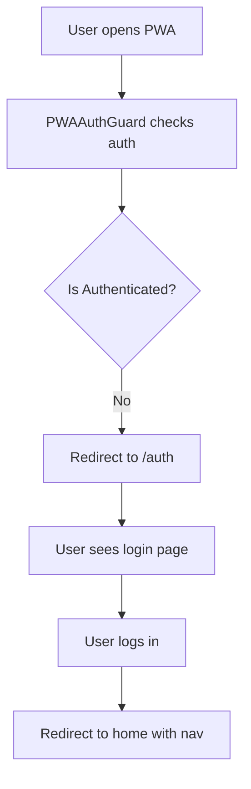
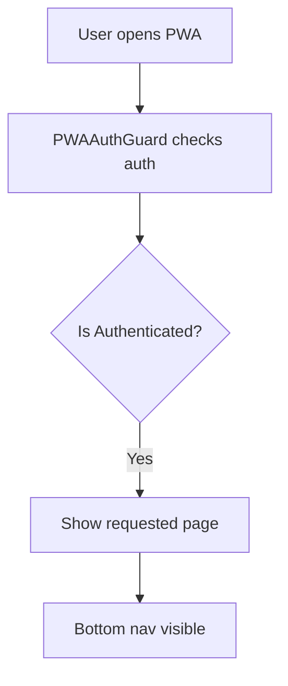
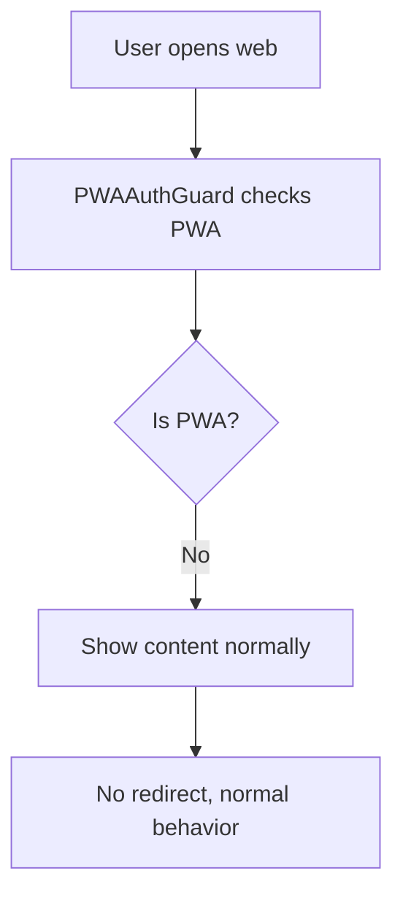

# 🔐 PWA Authentication Redirect Implementation

## 📱 Vấn đề
Khi lần đầu vào PWA mà chưa đăng nhập, người dùng vẫn thấy trang chủ và không có navigation. Điều này không phù hợp với UX pattern của PWA.

## ✅ Giải pháp
Implement **PWA Authentication Guard** để tự động redirect đến trang đăng nhập khi chưa authenticated.

## 🔧 Implementation Details

### 1. **PWAAuthGuard Component**
```tsx
// PWA Authentication Guard Component
const PWAAuthGuard = ({ children }: { children: React.ReactNode }) => {
  const { isAuthenticated, isLoading } = useAuth();
  const { isPWA } = usePWA();
  const location = useLocation();

  // If not PWA, render children normally
  if (!isPWA) {
    return <>{children}</>;
  }

  // If PWA and still loading auth, show loading
  if (isLoading) {
    return <PWASimpleLoading />;
  }

  // If PWA and not authenticated, redirect to auth
  if (!isAuthenticated) {
    return <Navigate to="/auth" replace />;
  }

  // If PWA and authenticated, render children
  return <>{children}</>;
};
```

**Logic:**
- ✅ **Web Mode**: Hoạt động bình thường, không redirect
- ✅ **PWA + Loading**: Hiển thị loading screen
- ✅ **PWA + Not Authenticated**: Redirect đến `/auth`
- ✅ **PWA + Authenticated**: Hiển thị nội dung bình thường

### 2. **Protected Routes Wrapping**
```tsx
// Wrap all protected routes with PWAAuthGuard
<Route
  path="/"
  element={
    <PWAAuthGuard>
      <PageTransition>
        <Index />
      </PageTransition>
    </PWAAuthGuard>
  }
/>

<Route 
  path="/create-trip" 
  element={
    <PWAAuthGuard>
      <PageTransition>
        <CreateTripPage />
      </PageTransition>
    </PWAAuthGuard>
  } 
/>

// ... other protected routes
```

**Protected Routes:**
- ✅ `/` (Home)
- ✅ `/create-trip`
- ✅ `/templates`
- ✅ `/my-trips`
- ✅ `/trip/:id`
- ✅ `/profile`
- ✅ `/notifications`
- ✅ `/settings`

**Public Routes (No Guard):**
- ✅ `/auth` (Login page)
- ✅ `/auth/google/callback`
- ✅ `/trip/:id/:shareToken` (Join trip)
- ✅ `/invite` (Invite accept)

### 3. **Navigation Logic Update**
```tsx
// Bottom Navigation for PWA - Only show when authenticated
{isAuthenticated && (
  <nav className="fixed bottom-0 left-0 right-0 z-50 bg-background/95 backdrop-blur-lg px-4 py-2 pb-10 hide-home-indicator">
    <div className="flex items-center justify-around max-w-6xl mx-auto">
      {pwaNavItems.map((item) => (
        <PWANavItem
          key={item.id}
          to={item.to}
          icon={item.icon}
          label={item.label}
          active={active === item.id}
          onClick={() => handleNavItemClick(item.id)}
          isHighlighted={item.isHighlighted}
        />
      ))}
    </div>
  </nav>
)}
```

**Changes:**
- ✅ **Removed**: `(isAuthenticated || isLoading)` condition
- ✅ **Simplified**: Only show when `isAuthenticated`
- ✅ **Cleaner**: No more disabled state logic needed

## 🔄 User Flow

### **PWA First Access (Not Authenticated):**


### **PWA Access (Authenticated):**


### **Web Access (Any State):**


## 🎯 Benefits

### **User Experience:**
- ✅ **Clear Path**: PWA users luôn biết phải đăng nhập trước
- ✅ **No Confusion**: Không còn thấy trang chủ mà không có nav
- ✅ **Consistent**: Behavior nhất quán với mobile app patterns
- ✅ **Secure**: Protected routes được bảo vệ tự động

### **Technical:**
- ✅ **Clean Architecture**: Separation of concerns với guard component
- ✅ **Reusable**: PWAAuthGuard có thể dùng cho routes khác
- ✅ **Maintainable**: Logic tập trung ở một nơi
- ✅ **Performance**: Không render unnecessary components

## 📱 Testing Scenarios

### **PWA Testing:**
1. ✅ **First Access (Not Authenticated)**: Should redirect to `/auth`
2. ✅ **After Login**: Should show home page with bottom nav
3. ✅ **Direct URL Access**: Protected routes should redirect to auth
4. ✅ **Auth Page Access**: Should work normally
5. ✅ **Loading State**: Should show loading screen during auth check

### **Web Testing:**
1. ✅ **Normal Access**: Should work as before (no redirect)
2. ✅ **Unauthenticated**: Should show home page normally
3. ✅ **Authenticated**: Should work normally

### **Edge Cases:**
1. ✅ **Network Error**: Should handle gracefully
2. ✅ **Token Expired**: Should redirect to auth
3. ✅ **Direct Deep Link**: Should redirect to auth then back to intended page

## 🔒 Security Considerations

### **Route Protection:**
- ✅ **Automatic**: All protected routes wrapped with guard
- ✅ **Consistent**: Same logic applied everywhere
- ✅ **Secure**: No way to bypass authentication in PWA

### **Token Handling:**
- ✅ **Validation**: AuthContext validates tokens
- ✅ **Expiry**: Handles token expiration gracefully
- ✅ **Storage**: Secure token storage in localStorage

## 📁 Files Modified

- ✅ **App.tsx**: Added PWAAuthGuard component and route wrapping
- ✅ **Navbar.tsx**: Simplified bottom nav logic
- ✅ **PWA_AUTH_REDIRECT.md**: This documentation

## 🎉 Summary

**PWA Authentication Redirect** đã được implement thành công:

- ✅ **Automatic Redirect**: PWA users được redirect đến `/auth` khi chưa đăng nhập
- ✅ **Clean UX**: Không còn thấy trang chủ mà không có navigation
- ✅ **Secure Routes**: Tất cả protected routes được bảo vệ tự động
- ✅ **Consistent Behavior**: Hoạt động nhất quán với mobile app patterns
- ✅ **Clean Architecture**: PWAAuthGuard component có thể tái sử dụng

**Kết quả**: PWA users giờ có trải nghiệm đăng nhập rõ ràng và nhất quán! 🔐📱✨
